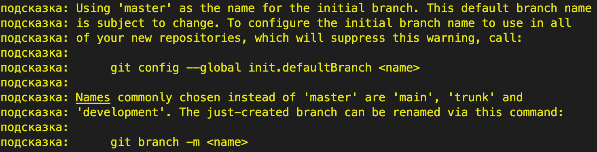
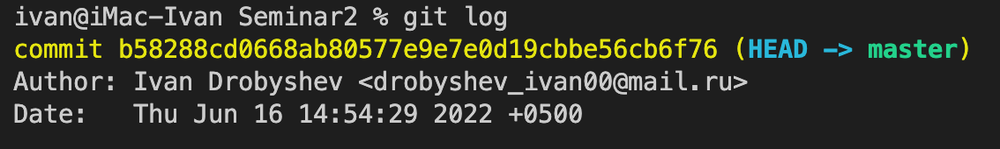

# Основные команды GIT

## **Инициализации локального репозитория**

Для создания репозитория в терминале ввести команду: 
    
    git init

После ввода комнады появляеться список подсказок:

Данная команды создает репозиторий в вашей папке для дальнейшего управления версиями ваших проектов

## **Получение информации о текущем состояние git**

Для посмотра текущее состояния репозитория введите в терминале команду:

    git status

После ввода команды в терминале появятся состояние вашего репозитория:

## **Добавление файла или файлов к следующему коммиту**

Чтобы добавить файл к следующему комииту в терминале введите команду:

    git add <имя_файла>

Так же можно добавить все файлы используя критерий **--all**

    git add --all

## **Создания коммита**

Для создания комита в терминале введите команду:

    git commit -m "<описание_коммита>"

 После ввода данной команды в терминале появиться сообщение что данный коммит создан:

## **Сравнения**

Для сравнения комиитов, [веток](#работа-с-ветками-в-git), файлов используйте команду:

    git diff <имя1> <имя2>

## **Вывод на экран истории всех коммитов с их хеш-кодами**

Для вывода всех коммитов введите команду:

    ivan@iMac-Ivan % git log

 У вас должен получиться вот такой результат:

Для вывода сокращенного спика коммитов введите в терминале команду:

    git log --oneline

У вас должен получиться вот такой результат:

## **Переход по коммитам**
Для переключения между коммитам используйте команду:

    git checkout <хеш-код>

## **Вспомогательные команды**

Для очищения окна в терминала нужно ввести следующую команду:

    clear

Чтобы вернутся в терминал нужно нажать кнопку:

    q

## **Работа с ветками в Git**

Ветки нужны для того, чтобы программисты могли вести совместную работу над проектом и не мешать друг другу при этом.

*Принцип работы веток*

### Создание новой ветки

Чтобы создать новую ветку используйте команду:
    
    git branch <Имя_ветки>

### Просмотр всех веток

Для просмотра всех веток используется команда 

    git branch

У вас должен получиться вот такой результат:

### Переход по веткам
Для переключения между ветками используйте команду:

    git checkout <имя_ветки>

### Слияние веток

Для слияния веток нужно ввести команду:

    git merge <Имя_ветки>

**ВАЖНО!** 
Перед слиянием нужно находиться в той ветке куда будем вливать изменения

### Удаления ветки
 
 Для удаления ветки используется команда 

    git branch -d <имя_ветки>

### Простором графа слияния

Что бы посмотреть граф слияние в терминале нужно ввести:

    git log --oneline --all --graph

где:

* **--oneline** - сокращенные коммиты

* **--all** - все коммиты

* **--graph** - сам граф

У вас должно получиться что такое:

